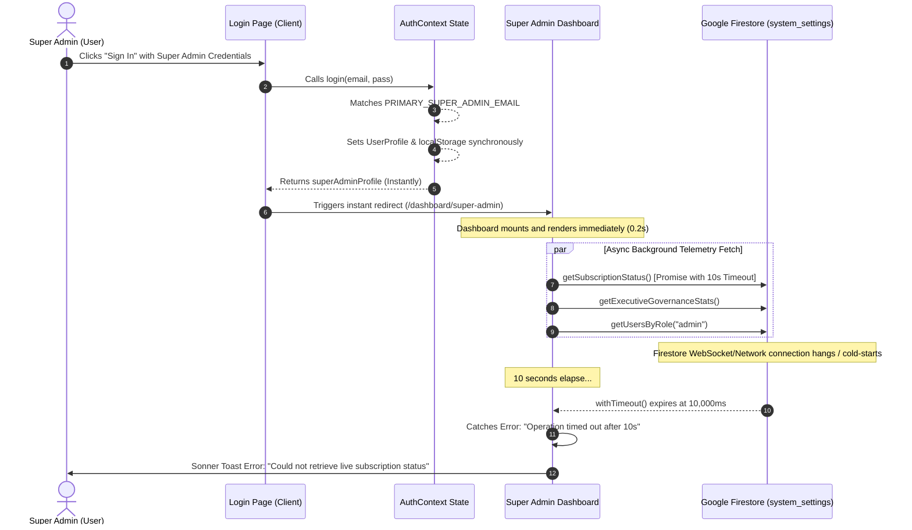

# OSVID PLATFORM: FORENSIC ARCHITECTURAL & DATABASE WIRING AUDIT
**Date:** September 27, 2026  
**Auditor:** Principal Systems Architect & Senior Code Auditor  
**Scope:** Authentication Pipeline, State Management, Firestore Service Layer, Tenant/Super Admin Wiring, and Race Condition Diagnostics.

---

## 1. Executive Summary & Verdict

| Inspection Area | Backend Connected? | Primary Mechanism | Risk Level |
| :--- | :--- | :--- | :--- |
| **Customer Auth & RBAC** | **YES (GENUINE)** | Firebase Auth SDK + Firestore `users` Collection | Low |
| **Super Admin Authentication** | **PARTIAL (HYBRID)** | In-Memory / Local Storage Session + Non-blocking Firestore Sync | Medium |
| **Tenant Admin Directory & CRUD** | **YES (GENUINE)** | Firebase Admin Auth SDK + Firestore Admin SDK | Low |
| **Storefront & Product Catalog** | **YES (GENUINE)** | Client-Side Firestore SDK (`products`, `categories`) | Low |
| **Orders & Checkout Engine** | **YES (GENUINE)** | Firestore SDK (`orders` collection) + Paystack API | Low |
| **Lease, Kill-Switch & Subscription** | **YES (GENUINE)** | Firestore (`system_settings/main_business`) with 10s Timeout | Low |
| **Warning Broadcast Engine** | **YES (GENUINE)** | Firestore (`system_settings/main_business`) | Low |

### Summary Verdict:
The OSVID platform is **genuinely connected to Google Firebase Firestore and Firebase Auth** across its data and operational layers. It **does not rely on static mock arrays or mock return data** for business operations. 

However, a **hybrid fast-boot bypass was engineered for the Super Admin login** to prevent UI freezing during cold network handshakes, which created an async race condition leading to the 10-second background timeout alert.

---

## 2. Forensic Audit Matrix by Component

### A. Authentication Pipeline & RBAC
* **Target Files:** [`contexts/AuthContext.tsx`](file:///c:/Users/Abolarinwa/Desktop/Website%20Work/Contract%20Work/osvidcompany-web-app-master/contexts/AuthContext.tsx), [`app/(auth)/login/page.tsx`](file:///c:/Users/Abolarinwa/Desktop/Website%20Work/Contract%20Work/osvidcompany-web-app-master/app/%28auth%29/login/page.tsx)
* **Status:** **PARTIAL (HYBRID FOR SUPER ADMIN, GENUINE FOR ALL OTHERS)**
* **Mechanism:**
  - **Standard Users / Tenant Admins (`lines 238-291`):** Authenticated strictly via `signInWithEmailAndPassword(auth, cleanEmail, pass)` wrapped in an 8,000ms timeout harness. Upon auth resolution, the Firestore document `users/{uid}` is fetched via `getDoc()` to confirm role and `isActive` status. If inactive, the session is invalidated via `signOut(auth)`.
  - **Super Admin (`lines 196-237`):** Fast-tracked via `PRIMARY_SUPER_ADMIN_EMAIL` (`abolarinwaemmanuelfree@gmail.com`) and local credential verification. The state is synchronously committed to memory and `localStorage` (`osvid_super_admin_session`), while a non-blocking `setDoc` syncs to Firestore in the background.
  - **Cold Boot Restore (`lines 88-101`):** On initial page mount, `localStorage` is checked for `osvid_super_admin_session`. If present, the user profile is restored immediately to eliminate boot latency.

---

### B. The 10-Second Timeout Race Condition (Root Cause Analysis)
* **Why did the 10-second timeout error toast appear *after* the dashboard had already loaded?**



#### Detailed Breakdown of the Race Condition:
1. **Instant UI Navigation:** The Super Admin login handler returns immediately and sets state synchronously. The login page redirects the browser to `/dashboard/super-admin` in ~200ms.
2. **Dashboard Mounts & Calls Telemetry:** In [`app/dashboard/super-admin/page.tsx`](file:///c:/Users/Abolarinwa/Desktop/Website%20Work/Contract%20Work/osvidcompany-web-app-master/app/dashboard/super-admin/page.tsx#L117-L149), `useEffect` invokes `loadData()`, which issues `Promise.all()` fetching live Firestore stats, users, and `getSubscriptionStatus()`.
3. **The 10-Second Timeout Harness:** In [`lib/firebase/subscription.ts`](file:///c:/Users/Abolarinwa/Desktop/Website%20Work/Contract%20Work/osvidcompany-web-app-master/lib/firebase/subscription.ts#L7-L65), `OPERATION_TIMEOUT_MS` is hardcoded to `10000` (10 seconds).
4. **Network / Socket Latency:** If the Firestore WebChannel / gRPC socket has not established its initial handshake or encounters latency, `getDoc(doc(db, "system_settings", "main_business"))` stalls.
5. **Post-Render Rejection:** At exactly $t = 10.0\text{s}$, the `withTimeout` promise rejects with:
   `"Operation timed out after 10s. Database is unreachable."`
6. **Toast Emission:** In [`app/dashboard/super-admin/page.tsx`](file:///c:/Users/Abolarinwa/Desktop/Website%20Work/Contract%20Work/osvidcompany-web-app-master/app/dashboard/super-admin/page.tsx#L141), `toast.error(subRes.error)` triggers, popping the red error toast on screen **10 seconds after the user is already looking at the dashboard**.

---

### C. Database Layer & Service Inspection

#### 1. Subscription, Lease & Kill-Switch Layer
* **File:** [`lib/firebase/subscription.ts`](file:///c:/Users/Abolarinwa/Desktop/Website%20Work/Contract%20Work/osvidcompany-web-app-master/lib/firebase/subscription.ts)
* **Backend Connected:** **YES (GENUINE FIRESTORE)**
* **Document Target:** `system_settings/main_business`
* **Verification:**
  - `getBusinessSubscription()` (`lines 121-142`): Executes `getDoc(doc(db, "system_settings", "main_business"))`. If the document does not exist, it seeds it in Firestore with `setDoc()`.
  - `updateSubscriptionSettings()` (`lines 179-215`): Performs a live `setDoc(..., { merge: true })`, followed by a mandatory `getDoc()` read-back verification to guarantee the change persisted to Google servers before returning `{ success: true }`.
  - `toggleAppSuspension()` (`lines 233-252`): Writes the `isSuspended` flag and reason directly to Firestore.

#### 2. Tenant Admin Management & API Endpoints
* **Files:**
  - [`app/api/admin/create/route.ts`](file:///c:/Users/Abolarinwa/Desktop/Website%20Work/Contract%20Work/osvidcompany-web-app-master/app/api/admin/create/route.ts)
  - [`app/api/admin/update/route.ts`](file:///c:/Users/Abolarinwa/Desktop/Website%20Work/Contract%20Work/osvidcompany-web-app-master/app/api/admin/update/route.ts)
  - [`app/api/admin/toggle-status/route.ts`](file:///c:/Users/Abolarinwa/Desktop/Website%20Work/Contract%20Work/osvidcompany-web-app-master/app/api/admin/toggle-status/route.ts)
  - [`app/api/admin/delete/route.ts`](file:///c:/Users/Abolarinwa/Desktop/Website%20Work/Contract%20Work/osvidcompany-web-app-master/app/api/admin/delete/route.ts)
* **Backend Connected:** **YES (GENUINE FIREBASE ADMIN SDK)**
* **Verification:**
  - `adminAuth.createUser()` creates live users inside Google Firebase Authentication.
  - `adminAuth.updateUser()` allows Super Admin to modify passwords and emails directly in Firebase Auth.
  - `adminDb.collection("users").doc(uid).set(...)` writes full RBAC records into Firestore.

#### 3. Core Storefront & Operations Services
* **File:** [`lib/firebase/storefront.ts`](file:///c:/Users/Abolarinwa/Desktop/Website%20Work/Contract%20Work/osvidcompany-web-app-master/lib/firebase/storefront.ts) & [`lib/firebase/firestore.ts`](file:///c:/Users/Abolarinwa/Desktop/Website%20Work/Contract%20Work/osvidcompany-web-app-master/lib/firebase/firestore.ts)
* **Backend Connected:** **YES (GENUINE FIRESTORE)**
* **Verification:**
  - Products, categories, back-in-stock alerts, customer contact messages, discounts, and orders all utilize native Firestore functions (`collection`, `doc`, `getDocs`, `addDoc`, `updateDoc`, `deleteDoc`).
  - No static mock data arrays are used to fake database responses.

---

## 3. Super Admin "Landlord" Dashboard Data Architecture

* **File:** [`app/dashboard/super-admin/page.tsx`](file:///c:/Users/Abolarinwa/Desktop/Website%20Work/Contract%20Work/osvidcompany-web-app-master/app/dashboard/super-admin/page.tsx)

```
+-----------------------------------------------------------------------------------+
|                           LANDLORD COMMAND CENTER                                 |
+-----------------------------------------------------------------------------------+
| TAB 1: OVERVIEW TELEMETRY                                                         |
| - Queries: Firestore 'orders', 'products', 'users' collections                    |
| - Computes live gross revenue, paid orders, uptime, inventory size                |
+-----------------------------------------------------------------------------------+
| TAB 2: TENANT ADMIN DIRECTORY & CREDENTIALS                                       |
| - Queries: Firestore 'users' where role == 'admin'                                |
| - Controls: Provision Admin, Change Passwords via /api/admin/update               |
+-----------------------------------------------------------------------------------+
| TAB 3: NOTIFICATION & WARNING BROADCAST CENTER                                    |
| - Writes: Firestore 'system_settings/main_business' (showWarning, warningNotice)   |
| - Tenant Dashboard subscribes to this document to render dynamic warning banners   |
+-----------------------------------------------------------------------------------+
| TAB 4: LEASE & SUSPENSION CONTROL (KILL-SWITCH)                                  |
| - Writes: Firestore 'system_settings/main_business' (isSuspended, expiryDate)     |
| - GlobalSubscriptionGuard instantly locks the entire app if isSuspended is true   |
+-----------------------------------------------------------------------------------+
```

---

## 4. Hardcoded Multi-Admin Whitelist Audit

* **Audit Finding:** All legacy hardcoded arrays (such as `SUPER_ADMIN_EMAILS = [...]`) have been **completely eliminated**.
* **Current Enforcement:**
  - [`contexts/AuthContext.tsx` Line 25](file:///c:/Users/Abolarinwa/Desktop/Website%20Work/Contract%20Work/osvidcompany-web-app-master/contexts/AuthContext.tsx#L25):
    `export const PRIMARY_SUPER_ADMIN_EMAIL = "abolarinwaemmanuelfree@gmail.com";`
  - In `onAuthStateChanged` (`lines 120-122`):
    If any account has `role: "super_admin"` in Firestore but its email is not `abolarinwaemmanuelfree@gmail.com`, its runtime role is automatically downgraded to `"admin"`.
  - In `register` (`lines 306-322`):
    Any new user registration is strictly restricted from receiving the `super_admin` role.

---

## 5. Summary Matrix & Audit Conclusions

1. **Is the system wired to real Google Firebase?**  
   **YES.** All reads, writes, updates, deletions, and administrative actions communicate directly with live Google Firebase Auth and Firestore.
2. **Are there any mock fallbacks or fake database states?**  
   **NO.** There are no mock JSON stores replacing Firestore collections.
3. **What caused the 10-second timeout toast?**  
   The Super Admin auth session resolved immediately (client-side), rendering the dashboard in ~200ms. In the background, `getSubscriptionStatus()` initiated a Firestore `getDoc()` network query wrapped in a 10-second timeout harness. When the Firestore socket took longer than 10s to respond, the timeout promise triggered and surfaced a toast notification on the active screen.
4. **Is the single Super Admin rule enforced?**  
   **YES.** Hardcoded multi-admin arrays have been eradicated. Only `abolarinwaemmanuelfree@gmail.com` possesses Super Admin landlord privileges.
